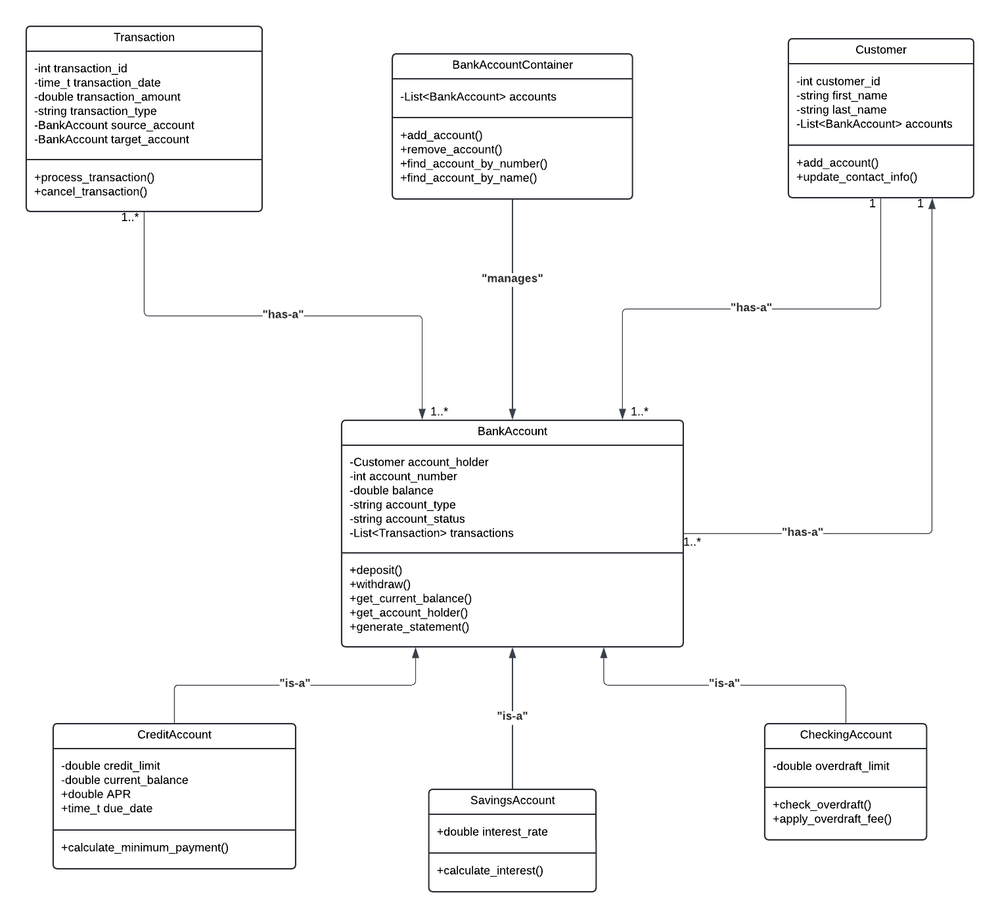

# Bank Account Management System

#### Team Members

* Jordan Bassett
* Tayler Caufield
* Austin Tesch

#### Course: CS162 | Instructor: Steve Smiley

## Overview

This project aims to develop a bank account management system that can effectively manage multiple bank accounts with various features, such as savings, checking, and credit accounts. It utilizes a series of data structures to create, save, and load account information in different formats. The project is divided into phases, with the current status covering Phases 1 and 2.

## Features to be Implemented

### Account Attributes (Phase 1)

* **Account Holder Name**: Managed using `string` variables for both first and last names to maintain structure.
* **Account Balance**: Stored as `double` for precise financial calculations.
* **Account Type**: Stores different types of accounts (e.g., "Checking", "Savings", "Credit") as text.
* **Interest Rate**: `double` type to handle precision in compounding calculations.
* **Transaction Amount**: `double` type to ensure accuracy.
* **Transaction Date**: Uses `time_t` to record the exact date of transactions.
* **Customer ID**: A unique `int` identifier for each customer.
* **PIN/Password**: Stored as a `string` and should be hashed or encrypted for security purposes.

#### Account Relationships and Class Hierarchy

The system employs object-oriented design, emphasizing both **inheritance** and **composition**:

* **Inheritance**: `BankAccount` is the base class for other account types such as `SavingsAccount`, `CheckingAccount`, and `CreditAccount`.
* **Composition**: The `Customer` class maintains a "has-a" relationship with `BankAccount` objects, indicating that customers can hold multiple accounts.
* **Classes Designed**:
  * `BankAccount` (Base Class)
  * `SavingsAccount`, `CheckingAccount`, `CreditAccount` (Derived from `BankAccount`)
  * `Transaction` (Handles transactions such as deposits, withdrawals, and transfers)
  * `Customer` (Stores customer information)
  * `BankAccountContainer` (Manages all `BankAccount` objects within the system)

#### Constructors

* **Default Constructor**: Initializes empty accounts with default values.
* **Overloaded Constructor**: Creates accounts with specific details at the time of initialization, allowing greater control over data.

#### Static Member Variables

* **Bank Name**: Shared across all accounts to avoid redundancy.
* **Interest Rate for Savings Accounts**: Static value to be easily updated.
* **Transaction Fee**: Consistent across all accounts.
* **Total Number of Accounts**: Useful for tracking and generating unique identifiers.

#### UML Diagram

<figure><figcaption></figcaption></figure>

### Saving and Loading Account Data (Phase 2)

* **Binary File Usage**: Provides efficiency for storing a large amount of data and ensures fast read/write times.
* **Text File Usage**: Provides human-readable format, making debugging easier.
* **File Handling**:
  * Discusses the pros and cons of binary vs. text files.
  * Covers appropriate data types for customer information in different file types.
  * Guides the usage of binary and text files based on the amount of data and the type of operations being performed.
* **Data Structures**: Provides a structured way to manage related information for a bank checking account, including error handling for file input validation with code samples.
